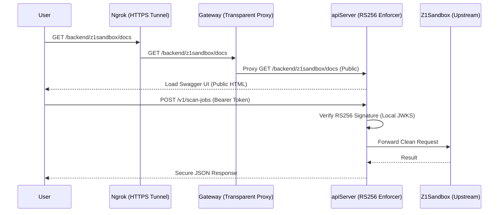

# CodeInspector Authentication: Hardened RS256 JWT System

This document details the hardened technical implementation of the CodeInspector authentication layer. The system utilizes **Asymmetric Cryptography (RS256)** and **Zero-Trust Backend Validation** to provide secure, cross-origin access (via ngrok) while preventing unauthorized access to core execution resources.

---

## 1. Architectural Design

The system follows a **Zero-Trust Architecture** where identity is verified as close to the compute resource as possible.

### Key Components
- **Identity Provider (IdP)**: The `apiServer` issues tokens signed with its RSA Private Key.
- **Resource Server (Backend)**: The `apiServer` also acts as the primary enforcer, validating every incoming request using the Public Keys (JWKS).
- **API Gateway**: Acts as a transparent proxy (`mode: none`), ensuring the `Authorization` header is preserved for the backend while managing CORS and TLS termination.

---

## 2. Technical Specifications

### A. Token Signature (RS256)
- **Algorithm**: `RS256` (Asymmetric RSA-SSA-PKCS1-v1_5 with SHA-256).
- **Key Configuration**:
    - **RS256 Private Key**: 2048-bit (Stored in `apiServer` ConfigMap).
    - **Header**: Includes `"kid": "code-inspector-key-01"` for key identification.
- **Claims Mapping**:
    - `iss` (Issuer): `code-inspector`
    - `aud` (Audience): `code-inspector-api`
    - `sub` (Subject): The `user_id` of the requester.
    - `exp` (Expiration): default 60 minutes.

### B. Backend Validation Logic
Validation is performed in the FastAPI `Depends(validate_token)` layer:
1. **Header Extraction**: Retrieves `Authorization: Bearer <JWT>`.
2. **KID Lookup**: Identifies the signing key version from the JWT header.
3. **JWKS Verification**: Validates the signature against the **Public Modulus (n)** and **Exponent (e)**.
4. **Claim Checks**: Ensures the token is not expired and matches the expected `iss` and `aud`.

### C. CORS Policy (Ngrok Support)
To support development through ngrok, the `apiServer` is configured with `CORSMiddleware`:
- **Allowed Origins**: Supports all Origins (`*`) to accommodate dynamic ngrok subdomains.
- **Credential Support**: `allow_credentials=True` ensures the Bearer header is respected during pre-flight (OPTIONS) requests.

---

## 3. Swagger UI Integration

### Main API Docs (`/docs`)
Supports standard OIDC/Bearer authentication. Click the **Authorize** button to persist the JWT across sessions.

### Backend Docs Proxy (`/backend/z1sandbox/docs`)
The system dynamically patches the upstream OpenAPI spec to support JWT:
- **Patch Logic**: Injects `components.securitySchemes.BearerAuth` (HTTP Bearer) into the JSON spec on-the-fly.
- **Usage**: Load the page publicly, click **Authorize** within the internal Swagger frame, and provide your JWT to unlock proxy endpoints.

---

## 4. Operational Maintenance

### Key Rotation
To rotate keys without downtime:
1. **Update Helm**: Add the new Public Key to `global.JWT_PUBLIC_JWKS` and the new Private Key to `apiServer`.
2. **Double Signing (Optional)**: Issue with the new kid while maintaining the old kid in the JWKS for a crossover period.
3. **Deploy**: `helm upgrade codeinspector ./codeInspector`.

### Troubleshooting
- **401 Unauthorized**: Token expired or signature invalid.
- **403 Forbidden**: Token missing or Bearer header malformed.
- **CORS Error**: Check `access-control-allow-origin` headers in the browser console; ensure standard `Authorization` header is white-listed in the gateway.

---
*Last Updated: 2026-04-21 by Antigravity*
