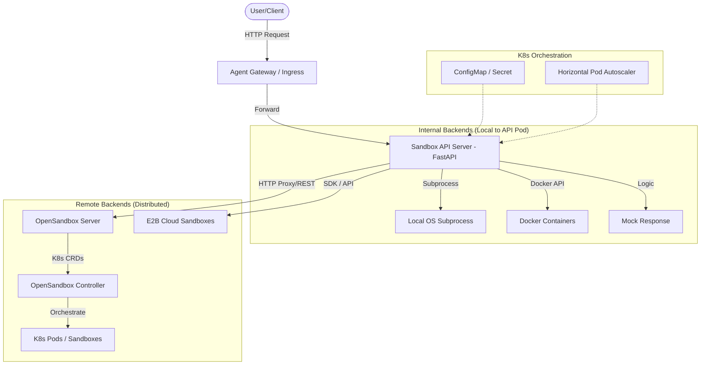

# CodeInspector: Swappable Sandbox Architecture

This document describes the flow and architecture of the **CodeInspector** system, a robust platform for executing untrusted code across multiple isolated backend environments.

## Architecture Overview

The system is designed with a **Facade Pattern**, where a stable FastAPI server provides a unified interface for code execution, while the underlying execution engine (backend) can be swapped dynamically.

---

## Core Components

### 1. Sandbox API Server (FastAPI)
The central orchestrator that exposes the stable HTTP contract. 
- **Endpoint Transformation**: It translates high-level requests (e.g., "run this Python code") into backend-specific commands.
- **Dynamic Registry**: Maintains a registry of available backends (`Mock`, `Subprocess`, `Docker`, `E2B`, `OpenSandbox`).
- **Transparent Proxy**: Provides a proxy mechanism (`/backend/{name}/{path}`) to allow direct interaction with specialized backend APIs without exposing them to the external network.

### 2. High-Level Gateway (Agent Gateway)
Implemented using the **Kubernetes Gateway API**, it provides a standardized way to route external traffic into the cluster.
- **Routing**: Maps external hosts (e.g., `sandbox-api.local`) to the internal `sandbox-api-service`.
- **Security**: Can be configured with policies (via `agentgatewaypolicy.yaml`) to restrict access.

### 3. OpenSandbox (K8s Native)
A distributed sandbox system managed via Helm.
- **OpenSandbox Controller**: A Kubernetes Operator that manages the lifecycle of sandboxes using CRDs (`Pool`, `BatchSandbox`). It handles resource pooling for low-latency sandbox creation.
- **OpenSandbox Server**: Provides the REST API that the main Sandbox API communicates with when the `opensandbox` backend is selected.

### 4. Local Executors
- **Subprocess**: Best for testing; runs code within the same environment as the API server.
- **Docker**: Runs code in ephemeral, network-isolated containers on the host where the API server resides.

---

## Technical Flow

### 1. Code Execution Flow (`/run`)
1.  **Client Request**: The user sends a POST request to `/run` with `code`, `language`, and `timeout`.
2.  **State Lookup**: The API server identifies the currently active backend (defaulting to `mock` or as set via `/backend/switch`).
3.  **Backend Execution**:
    -   If **Local**: The server spawns a process or container, captures output, and returns a `RunResponse`.
    -   If **Remote (OpenSandbox)**: The server forwards the payload to the `BACKEND_URL_OPENSANDBOX` (configured via ConfigMap).
4.  **Response**: The client receives a standardized JSON response containing `stdout`, `stderr`, and `exit_code`, regardless of the backend used.

### 2. Backend Switching Flow (`/backend/switch`)
1.  **Request**: An admin sends a POST to `/backend/switch` with the desired backend name.
2.  **Validation**: If `validate=true`, the API server performs a health check on the target backend (e.g., checking if Docker is running or if OpenSandbox is reachable).
3.  **Hot Swap**: Upon success, the `AppState` is updated globally. All subsequent `/run` calls now use the new backend immediately without server restart.

### 3. Transparent Proxying (`/backend/z1sandbox/*`)
1.  **Intercept**: The API server matches the dynamic route `/backend/{backend_name}/{proxy_path}`.
2.  **Re-routing**: It strips the prefix and forwards the headers/body to the internal service URL (e.g., `http://opensandbox-server.opensandbox-system.svc.cluster.local`).
3.  **Response Relay**: The response from the internal service is relayed back to the original client, making the API server act as a secure gateway.

---

## Infrastructure Summary (K8s)

| Resource | Purpose |
| :--- | :--- |
| **Namespace** | `sandbox` — Isolates the entire stack. |
| **ConfigMap** | `sandbox-api-config` — Stores internal service discovery URLs. |
| **Deployment** | `sandbox-api` — Runs the FastAPI orchestrator with 1-10 replicas. |
| **HPA** | `sandbox-api-hpa` — Automatically scales based on CPU (>70%) and Memory (>80%) usage. |
| **Service** | `sandbox-api-service` — Internal load balancer for the API pods. |
| **Ingress** | `sandbox-api-ingress` — Exposes the API to external clients with timeout configurations. |
