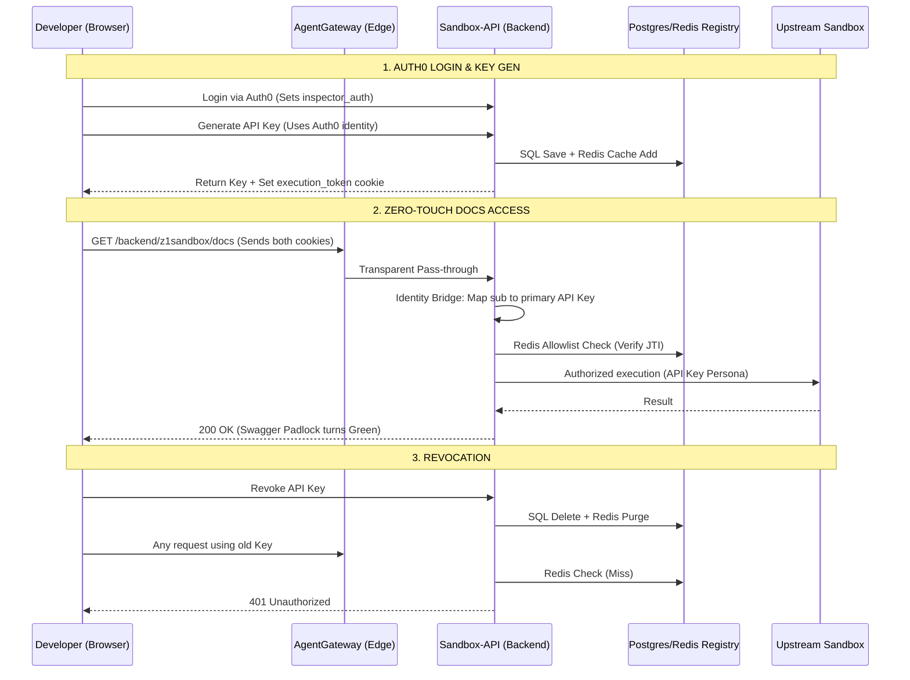

# Technical Documentation: API Key Generation & Authentication

This document outlines the technical implementation of the self-service API key management system used in the CodeInspector platform.

## 1. Generation Process
The API key generation is triggered via the developer dashboard and handled by the `POST /v1/api-keys` endpoint.

### Flow Breakdown:
1.  **Request**: The frontend sends a request containing the key `name`, `target_backend`, and `ttl_hours`.
2.  **Identity Verification**: The backend verifies the user's active Auth0 session via a `Bearer` token or browser cookie. The user's unique identity (`sub`) is extracted.
3.  **Payload Creation**: A JSON payload is constructed with the following standard and custom claims:
    *   `sub`: The Auth0 User ID.
    *   `iat`: Issued At (current UTC timestamp).
    *   `exp`: Expiration (current timestamp + selected TTL).
    *   `iss`: `code-inspector` (Issuer ID).
    *   `aud`: `code-inspector-api` (Audience ID).
    *   `jti`: A unique UUID v4 (JWT ID) used for tracking and revocation.
    *   `backend`: The designated backend scope (e.g., `Z1_SANDBOX`).
4.  **Asymmetric Signing**: The payload is signed using the **RS256** algorithm:
    *   **Private Key**: Used by the backend to sign the token.
    *   **Header**: Includes a `kid` (Key ID) used by consumers to identify the correct public key for verification.
5.  **Persistence**: The key metadata (Name, Prefix, Expiry, UserID, JTI) is saved to a SQLite database. The full signed JWT is returned to the user **once** and is never stored on the server.

## 2. Authentication Context
When an API key is presented in a request:

### Layer 1: Cryptographic Validation
The **AgentGateway** and Backend use the **Public JWKS** (JSON Web Key Set) to verify the signature. This ensures the key was created by our system and hasn't been modified.

### Layer 2: Lifecycle Management (Active Registry)
The system verifies the `jti` claim against the **Active Registry** (Allowlist). 
- If the `jti` is missing from the database, it is considered **deleted or deactivated** and rejected.
- If the `jti` exists but is marked as `is_revoked`, it is rejected.
- This ensures that mere cryptographic validity is insufficient for access; the key must be actively registered in the live database.

### Layer 3: Backend Scoping
The backend enforces the `backend` claim. If a key is scoped to `Z1_SANDBOX`, any attempt to access unauthorized backend paths will result in a `403 Forbidden`.

### Layer 4: Session Alignment
For browser-based sessions, the backend compares the `sub` claim of the API key with the `sub` claim of the active Auth0 cookie. This prevents "Key Leaking" where a user might attempt to use another developer's leaked key within their own session.

## 3. AgentGateway Enforcement
Before any request reaches the application backend, it is intercepted and validated at the edge by the **AgentGateway**.

### Edge Validation Logic:
- **Traffic Interception**: The Gateway targets the `HTTPRoute` for all API traffic using an `AgentgatewayPolicy`.
- **Pure Pass-Through**: To prevent header stripping and ensure data integrity, the Gateway is configured as a transparent pass-through. It directs the raw `Authorization` headers and `Cookies` directly to the backend for unified processing.
- **Identity Forwarding**: Successfully routed traffic is forwarded to the backend, enabling a "Defense in Depth" strategy where the backend manages granular database verification.

## 4. The Zero-Touch Authentication Lifecycle
The system implements a multi-phase "Zero-Touch" flow that bridges management identity (Auth0) with high-security execution rights (Internal API Keys).

### Phase 1: Identity Establishment (Auth0)
1.  **Authentication**: Users log into the Dashboard via Auth0.
2.  **Session Token**: Auth0 issues an RS256 JWT (OIDC). This token is stored in the browser as the `inspector_auth` cookie.
3.  **Role**: Proves the user's management identity (`sub`) but is prohibited from direct backend execution.

### Phase 2: Key Management & Synchronization
1.  **Generation**: Using the Auth0 session, the user creates an API Key.
2.  **Registry Persistence**: The backend verifies the Auth0 token and records the new API Key in the **PostgreSQL Registry**, linked to the user's `sub`.
3.  **Instant Binding**: The Dashboard immediately synchronizes the new key to the browser's `execution_token` cookie.

### Phase 3: Secure Transport (AgentGateway)
1.  **Traffic Interception**: When accessing backend documentation, the browser sends both the `inspector_auth` and `execution_token` cookies.
2.  **Encrypted Tunnel**: The **AgentGateway** intercepts the request over HTTPS.
3.  **Transparent Routing**: The gateway acts as a pass-through, forwarding all security credentials directly to the backend without modification.

### Phase 4: The Identity Bridge (Backend Validation)
The backend `validate_token` middleware performs the final handshake:
1.  **Extraction**: The backend prioritizes the `execution_token`.
2.  **Mapping**: If valid keys exist, the **Identity Bridge** maps the management session to the user's primary Developer API Key in real-time.
3.  **Distributed Check**: The system validates the key ID (`jti`) against the **Redis Distributed Allowlist** for line-rate verification.

### Phase 5: Managed Doc Authorization (Swagger UI)
1.  **UI Injection**: The backend renders the Swagger UI with an embedded auto-authorization script.
2.  **Automatic Lock**: The script reads the `execution_token` and programmatically authorizes the session via `ui.authActions.authorize`.
3.  **Execution Persona**: Future "Try it out" requests from the browser are now strictly authorized by the **Developer API Key**, fulfilling the "API-Key-Only" enforcement principle.

## 5. End-to-End Architecture Diagram
The following diagram illustrates the complete lifecycle of a Developer API Key and its bridge to Auth0.

## 6. Technical Components (Production)
1.  **The Token**: Signed RS256 JWT with scoped claims.
2.  **The AgentGateway**: High-performance entry point using transparent pass-through for all security credentials.
3.  **The Identity Bridge**: Middleware that maps Auth0 dashboard sessions to their respective Developer API Keys in real-time.
4.  **The Registry**: Combined PostgreSQL persistence and Redis distributed allowlist for line-rate validation.

---
*Last Updated: April 2026 (Version 2.0 - Zero-Touch Architecture)*
