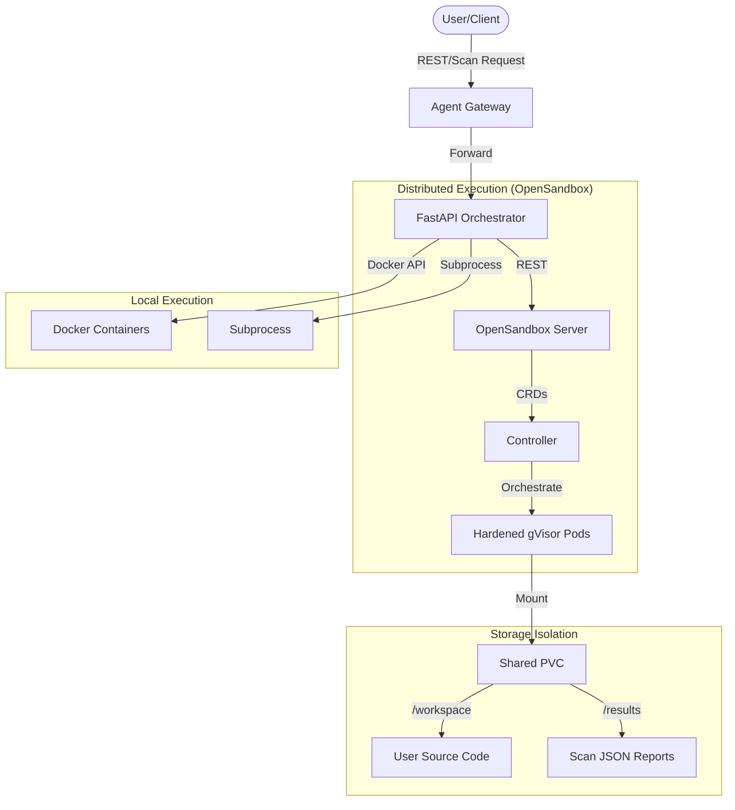

# CodeInspector: Swappable Sandbox & Automated Security Pipeline

## Overview

CodeInspector is a Kubernetes-native, security-first platform for executing untrusted code in isolated environments. Built with a **Facade Architecture**, it provides a unified FastAPI gateway that supports multiple execution backends while integrating an **Automated Security Scanning Pipeline** directly into the sandbox lifecycle.

### Key Pillars
- **Secure by Design**: Uses **gVisor** (runsc) for kernel-level isolation and strict **Agent Gateway** API-key enforcement.
- **Asynchronous Execution**: Uses a **Fire-and-Forget** model for sandbox creation and scanning, ensuring the API remains responsive under high load (e.g., 50+ concurrent users).
- **Isolated Persistence**: Uses job-specific sub-paths on a shared PVC to isolate source code from security reports.

---

## Architecture

The system is designed to provide a stable interface regardless of the underlying execution engine.



---

## Automated Security Scanning Pipeline

CodeInspector features a sophisticated scanning system that audits code before and during execution.

### High-Level Scan API (`/v1/scan-jobs`)
A dedicated endpoint for bulk security audits designed for high-concurrency environments.
1. **Instant Acknowledgement**: Returns a `job_id` and `sandbox_id` in milliseconds.
2. **Persistence**: Every file is stored in a unique path `/data/{job_id}/{workspace|reports}` on a shared PVC.
3. **Background Provisioning**: Schedules a sandbox in Kubernetes without blocking the API.
4. **Retrieval**: Results are persistent and can be fetched via `GET /v1/scan-jobs/{job_id}/report`.
5. **Automation**: The sandbox entrypoint automatically triggers the `ScannerOrchestrator` upon container startup.

### The Security Toolchain
| Tool | Scope | Action |
| :--- | :--- | :--- |
| **Semgrep** | Logic & Vulns | Multi-language static analysis with auto-config. |
| **Gitleaks** | Secrets | Scans for leaked credentials, tokens, and keys. |
| **Bandit** | Python | Specialized security linting for Python code. |
| **Trivy** | Filesystem | Scans for OS vulnerabilities and misconfigurations. |
| **YAMLlint** | Config | Validates security and syntax in YAML configurations. |

---

## Local Development & Image Building

To build the core OpenSandbox components locally for custom versions:

### Build Server
```bash
cd opensandbox-server/docker-build
docker build -t opensandbox-server:local .
```

### Build Controller
```bash
cd opensandbox-controller/docker-build
docker build -t opensandbox-controller:local .
```

### Build Code Interpreter (Sandbox)
```bash
cd code-interpreter
docker build -t codeinterpreter:3.1.0 .
```

---

## Native Kubernetes Provisioning

CodeInspector supports two primary ways to provision sandboxes within a Kubernetes cluster:

### Method A: REST API (via OpenSandbox Server)
Submit a `POST` request to the API server. This is the recommended method for application-driven workflows.
```bash
curl -X POST "http://localhost:8080/v1/sandboxes" \
  -H "Content-Type: application/json" \
  -d '{
    "image": { "uri": "codeinterpreter:3.1.0" },
    "entrypoint": ["/bin/sh"],
    "timeout": 3600
  }'
```

### Method B: Declarative YAML (via K8s Controller)
Submit a `BatchSandbox` CRD directly to the cluster. This is the "Kubernetes Native" way.
```yaml
apiVersion: sandbox.opensandbox.io/v1alpha1
kind: BatchSandbox
metadata:
  name: my-sandbox
spec:
  replicas: 1
  template:
    spec:
      containers:
      - name: sandbox-container
        image: codeinterpreter:3.1.0
```

---

## Troubleshooting & Critical Fixes

The following issues are pre-configured and fixed in this version of the stack:

1. **Missing CRDs**: CRDs are now located in `opensandbox/crds/` for Helm 3 auto-installation.
2. **RBAC Permissions**: `ClusterRole` updated to allow `sandbox.opensandbox.io` apiGroup access.
3. **Probe Failures**: Controller ports fixed (8081 for healthz/metrics). Server health routes aligned to `/health`.
4. **Kubeconfig Mounting**: Server configured to use `incluster` hooks via ConfigMap, preventing `Invalid kube-config` crashes.

---

## Infrastructure Summary (K8s)

| Resource | Purpose |
| :--- | :--- |
| **Namespace** | `sandbox` — Virtual isolation for the stack. |
| **RuntimeClass** | `gvisor` — Ensures pods run with `runsc` isolation. |
| **MetalLB** | Provides local IP address management for the Gateway. |
| **HPA** | Scales the API Gateway from 1 to 10 replicas based on load. |

---

## Usage Examples

### Execute a Scan Job
```bash
curl -X POST http://sandbox-api.local/v1/scan-jobs \
  -H "Content-Type: application/json" \
  -d '{
    "files": {
      "main.py": "import os\nprint(os.getenv(\"SECRET_KEY\"))"
    },
    "tools": ["semgrep", "bandit"],
    "metadata": {"project": "audit-v1"}
  }'
```

### Hot-Swap Backend
```bash
curl -X POST http://sandbox-api.local/backend/switch \
  -H "Content-Type: application/json" \
  -d '{"backend": "opensandbox", "validate": true}'
```

---

## Project Structure

```text
codeInspector/
├── apiServer/
│   ├── fastapi/               # Gateway logic & Strategy implementation
│   └── k8s/                   # API deployment & HPA manifests
├── code-interpreter/
│   ├── scripts/
│   │   └── code-interpreter.sh # Sandbox entrypoint & scan trigger
│   ├── src/
│   │   └── scanner_orchestrator.py # Security tool orchestration logic
│   └── Dockerfile             # Hardened image with pre-installed toolchain
├── agentgateway/              # Gateway API & Security Policy configuration
├── kindCluster/               # Kind cluster config & gVisor setup scripts
├── k8s/                       # Global infra (MetalLB, etc.)
└── opensandbox-server/        # Source for the REST Server
└── opensandbox-controller/    # Source for the K8s Operator
└── opensandbox/               # Helm charts for the K8s operator
```
