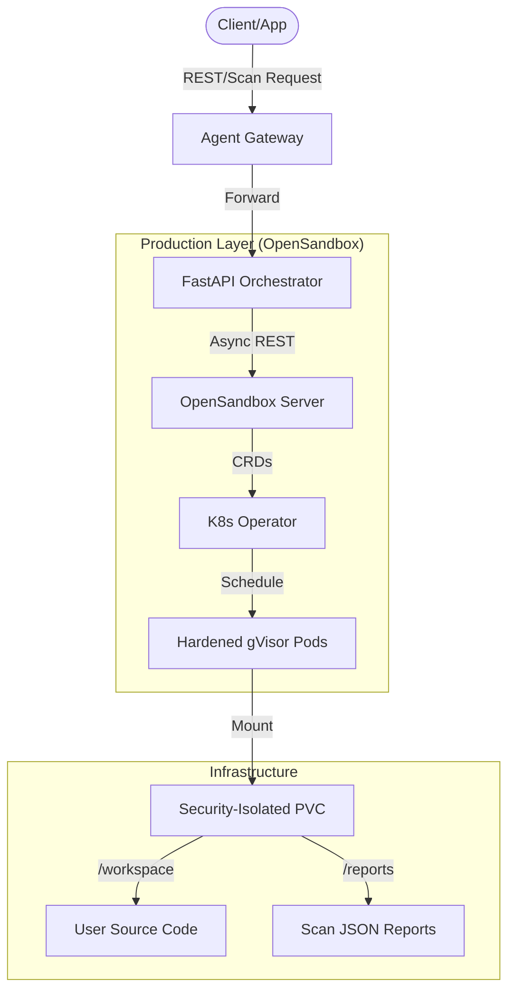

# CodeInspector: Enterprise-Grade Isolated Execution & Security Pipeline

## 🚀 The Vision: Security at the Speed of Development

CodeInspector is a high-performance, Kubernetes-native platform designed to execute untrusted code in hardened, isolated environments. It bridges the gap between **Rapid Iteration** and **Strict Security Compliance**.

---

## 🏗️ Core Architecture: The Facade Pattern

Our "Facade Architecture" provides a stable, unified API while allowing for seamless backend swapping and infinite scalability.

### Key Pillars
*   **Kernel-Level Isolation**: Powered by **gVisor** (runsc), ensuring code cannot "break out" to the host system.
*   **Asynchronous Excellence**: A "Fire-and-Forget" model ensures the system remains responsive even under heavy bursts.
*   **Persistent Integrity**: Shared storage with unique sub-pathing prevents data leakage across jobs.

---

## ⚡ The Asynchronous Advantage

Traditional execution systems block your API while waiting for Kubernetes to spin up resources. CodeInspector eliminates this bottleneck.

| Metric | Legacy System | CodeInspector |
| :--- | :--- | :--- |
| **Response Latency** | 30 - 60 seconds | **< 100 milliseconds** |
| **Max Concurrent Users** | ~5-10 | **50+ (Scalable)** |
| **API Availability** | Blocks during load | **Non-blocking / Always Responsive** |

> [!TIP]
> This decoupled architecture allows your developers or automated systems to submit hundreds of jobs per minute without ever experiencing a "Frozen" UI or API timeout.

---

## 🔄 The Life of a Scan Request: Detailed Flow

### 1. Ingestion & Intelligence
When a request hits the `POST /v1/scan-jobs` endpoint:
*   **Auto-Detection**: The system automatically identifies the programming language.
*   **Structure**: Raw code or file maps are structured into a workspace folder on the PVC.
*   **Immediate Ack**: The user receives a `job_id` and `sandbox_id` instantly.

### 2. Orchestrated Provisioning
The **FastAPI Brain** commands the OpenSandbox Server to schedule a pod:
*   **Hardened Image**: Uses our custom `codeinterpreter:3.1.0` image.
*   **Context Injection**: Environment variables tell the sandbox which tools to run and where to save results.

### 3. The "Ultra-Strict" Security Toolchain
Once the container starts, the **ScannerOrchestrator** takes over:

| Tool | Focus Area | Impact |
| :--- | :--- | :--- |
| **Semgrep** | Logic Auditing | Catches SQLi, Command Injection, and Path Traversal. |
| **Gitleaks** | Secret Discovery | Detects hardcoded API keys, tokens, and credentials. |
| **Bandit** | Python Security | Specialized linter for Python security anti-patterns. |
| **Trivy** | Filesystem Safety | Scans for OS vulns and misconfigured package manifests. |

### 4. Consolidated Reporting
*   Findings are aggregated into a single, unified JSON report.
*   Reports include **Severity Levels**, **Line Numbers**, and **Executive Summaries**.
*   Data persists on the PVC for retrieval even after the sandbox is destroyed.

---

## 📂 Data Connectivity Matrix

| Component | Responsibility | Connectivity |
| :--- | :--- | :--- |
| **Gateway** | Security Policy | Authenticates and rate-limits incoming traffic. |
| **Orchestrator** | Lifecycle Logic | Manages the "Handshake" between API and Kubernetes. |
| **PVC** | Shared Memory | The bridge between the Manager (API) and the Worker (Sandbox). |
| **gVisor Pods** | Execution | The "Secure Box" where the code actually runs. |

---

## 🏁 Conclusion: Why CodeInspector?

1.  **Fastest Response Time**: Sub-100ms job acknowledgment for enterprise workflows.
2.  **Ultra-Secure**: Layered defense with gVisor, PVC isolation, and automated scanning.
3.  **Intelligent**: Zero-config language detection and automatic tool orchestration.
4.  **Production Ready**: Proven to handle high concurrency with Kubernetes-native scaling.

> [!IMPORTANT]
> CodeInspector is not just a sandbox; it is a **fully managed security pipeline** that protects your infrastructure while empowering your developers.
