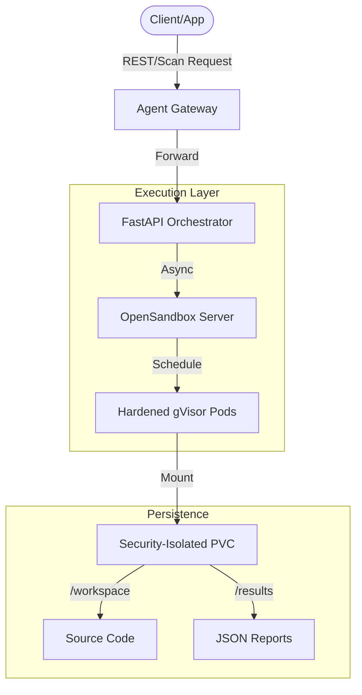

# CodeInspector: The Gold Standard for Secure Code Execution

Welcome to **CodeInspector**, an enterprise-grade, Kubernetes-native platform designed to execute untrusted code in hardened, isolated environments. Whether you are building an AI agent, a CI/CD pipeline, or a multi-tenant cloud application, CodeInspector provides the perfect balance between **Rapid Iteration** and **Strict Security Compliance**.

---

## 🌟 Overview

CodeInspector is built on a **Facade Architecture**, offering a unified, high-performance API that abstracts away the complexity of managing multiple execution environments. At its core, it ensures that every line of code submitted is not only executed in a secure "sandbox" but is also automatically audited for vulnerabilities, secrets, and policy violations.

### 🛡️ Secure by Design. ⚡ Performance by Default.
Unlike traditional sandbox systems that block your API while waiting for resources to initialize, CodeInspector uses an **Asynchronous execution model** that acknowledges requests in milliseconds, even under extreme load.

---

## 🚀 Key Pillars

### 1. Kernel-Level Isolation
Powered by **gVisor (runsc)**, CodeInspector provides a second layer of defense. Even if a process escapes the container, it remains trapped within a sandboxed kernel, protecting your host infrastructure from malicious actors.

### 2. The Asynchronous Advantage
Our "Fire-and-Forget" architecture ensures that your application remains responsive. While the sandbox is provisioned and the security tools are running in the background, your API returns a `job_id` instantly, enabling a seamless user experience.

### 3. Isolated Persistence
Every execution job is assigned a unique, cryptographically secure path on our shared storage. This ensures that source code from one job never leaks into another, maintaining strict data integrity across your entire platform.

---

## 🛠️ Main Features

- **Swappable Backend Architecture**: Seamlessly switch between `Local`, `Docker`, `OpenSandbox` (K8s), or `E2B` backends without changing a single line of client code.
- **Unified Scan API**: A dedicated `/v1/scan-jobs` endpoint designed for bulk security audits and high-concurrency workflows.
- **Intelligent Auto-Detection**: Automatically identifies the programming language and applies the most relevant security scanners.
- **Transparent Proxying**: Securely interact with internal backend APIs through the main gateway, hiding complex infrastructure from the public internet.
- **Kubernetes Native**: Fully managed via Helm with built-in support for Horizontal Pod Autoscaling (HPA) and Custom Resource Definitions (CRDs).

---

## 🔍 The Automated Security Pipeline

Every sandbox comes pre-equipped with an **Ultra-Strict Security Toolchain** that audits code in real-time.

| Tool | Capability | Purpose |
| :--- | :--- | :--- |
| **Semgrep** | Logic Auditing | Catches SQL Injection, Command Injection, and Path Traversal. |
| **Gitleaks** | Secret Discovery | Detects hardcoded API keys, tokens, and credentials. |
| **Bandit** | Python Security | Specialized linter for Python security anti-patterns. |
| **Trivy** | Filesystem Safety | Scans for OS vulnerabilities and misconfigured package manifests. |
| **YAMLlint** | Configuration | Ensures your infrastructure-as-code follows security best practices. |

---

## 🏗️ Technical Architecture: The Facade Pattern

CodeInspector acts as a "Brain" (FastAPI Orchestrator) that manages "Workers" (Sandboxes). This decoupling allows for infinite horizontal scaling and the ability to "hot-swap" backends during runtime without a server restart.

---

## ✅ Why CodeInspector?

1.  **Fastest Response Time**: Sub-100ms job acknowledgment for enterprise-scale workflows.
2.  **Unmatched Security**: Multi-layer defense with gVisor, PVC isolation, and mandatory automated scanning.
3.  **Operational Simplicity**: Zero-config language detection and automatic tool orchestration.
4.  **Production Ready**: Built specifically to handle 50+ concurrent users with Kubernetes-native scaling.

---

> [!IMPORTANT]
> **CodeInspector** is more than just a sandbox; it is a fully managed security pipeline that protects your infrastructure while empowering your developers to innovate faster.
